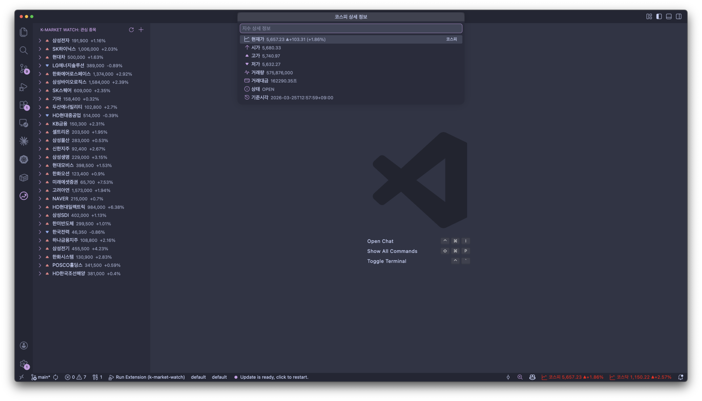

# K-Market Watch

VS Code에서 한국 주식시장(KOSPI/KOSDAQ)을 실시간으로 모니터링하는 확장 프로그램입니다.

코딩하면서 주식 시세를 확인하기 위해 브라우저를 열 필요 없이, VS Code 안에서 바로 확인하세요.

## Features

### Status Bar - KOSPI/KOSDAQ 지수

Status Bar에서 KOSPI와 KOSDAQ 지수를 실시간으로 확인할 수 있습니다.

- 상승(빨간색), 하락(파란색)에 따른 색상 표시
- 클릭하면 시가, 고가, 저가, 거래량, 거래대금 등 상세 정보 확인

### Sidebar - 관심 종목 관리

Activity Bar의 K-Market Watch 패널에서 관심 종목을 관리합니다.

- 종목별 현재가, 등락률 한눈에 확인
- 종목을 펼치면 시가, 고가, 저가, 거래량, 거래대금 등 상세 정보 표시
- 상승/하락/보합 아이콘으로 시세 방향 표시

### 종목 검색

종목명 또는 종목코드로 관심 종목을 추가할 수 있습니다.

- `삼성전자`, `NAVER` 등 종목명으로 검색
- `005930` 등 6자리 종목코드로 직접 추가
- 검색 결과에서 종목명, 코드, 시장(코스피/코스닥)을 확인하고 선택

## Extension Settings

| 설정 | 타입 | 기본값 | 설명 |
|------|------|--------|------|
| `k-market-watch.refreshInterval` | `number` | `15` | 데이터 갱신 주기 (초, 최소 5초) |
| `k-market-watch.showKospi` | `boolean` | `true` | Status Bar에 KOSPI 지수 표시 |
| `k-market-watch.showKosdaq` | `boolean` | `true` | Status Bar에 KOSDAQ 지수 표시 |
| `k-market-watch.indexNameLanguage` | `string` | `korean` | 지수 이름 표기 언어 (`korean`: 코스피/코스닥, `english`: KOSPI/KOSDAQ) |

## Commands

| 명령 | 설명 |
|------|------|
| 종목 추가 | 종목명 또는 종목코드로 관심 종목 추가 |
| 종목 삭제 | 관심 종목에서 제거 |
| 새로고침 | 시세 데이터 즉시 갱신 |
| KOSPI 상세 정보 | KOSPI 지수 상세 보기 (Status Bar 클릭) |
| KOSDAQ 상세 정보 | KOSDAQ 지수 상세 보기 (Status Bar 클릭) |

## Data Source

[네이버 금융](https://finance.naver.com) 실시간 시세 API를 사용합니다.

- 장 운영 시간: 평일 09:00 ~ 15:30 (KST)
- 장 마감 후에도 마지막 시세 데이터를 표시합니다

## License

MIT
